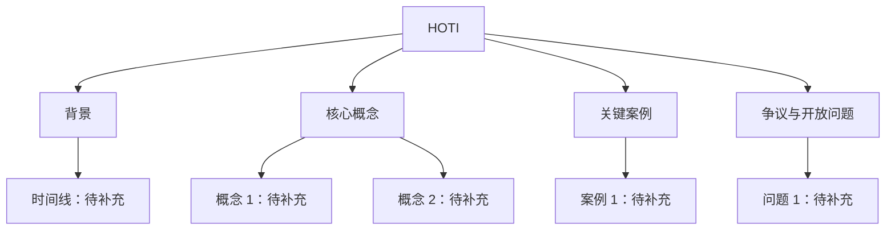

# HOTI 交互式学习笔记

> [!warning] 资料状态
> 当前仓库尚未发现 HOTI 的原始资料或正式来源。本页先作为交互式学习框架使用；涉及定义、历史、人物、结论和数据的内容都需要在补充来源后再确认。

## 学习目标

完成本页后，应该能够：

- [ ] 用自己的话说明 HOTI 的全称、研究对象和核心问题。
- [ ] 画出 HOTI 的主要概念关系图。
- [ ] 区分“事实”“解释”“例子”“个人理解”。
- [ ] 针对一个具体案例，说明它为什么属于 HOTI 的讨论范围。
- [ ] 留下可复盘的错题、疑问和下一步阅读计划。

## 0. 学习前自测

不要查资料，先凭当前理解作答。

### Q0.1 HOTI 是什么？

你的作答：

> 

自评：

- [ ] 完全不会
- [ ] 知道名字但说不清
- [ ] 能粗略解释
- [ ] 能举例并说明边界

### Q0.2 我最想解决的 3 个问题

1. 
2. 
3. 

## 1. 核心卡片

| 项目 | 内容 |
| --- | --- |
| 全称 | 待补充 |
| 所属领域 | 待补充 |
| 关键词 | 待补充 |
| 核心问题 | 待补充 |
| 代表人物 / 文献 | 待补充 |
| 适合连接的仓库笔记 | 待补充 |

> [!tip] 填写原则
> 每一行都尽量写成可以被来源验证的短句。不能验证的内容先标注“待校对”。

## 2. 概念地图

## 3. 分层笔记区

### 3.1 事实层

只写可以从来源中直接确认的内容。

- 

### 3.2 解释层

用自己的话解释事实之间的关系。

- 

### 3.3 例子层

每个例子都要说明它支持哪个概念。

| 例子 | 对应概念 | 为什么相关 | 来源 |
| --- | --- | --- | --- |
| 待补充 | 待补充 | 待补充 | 待补充 |

### 3.4 疑问层

| 问题 | 为什么重要 | 当前猜测 | 需要查什么 |
| --- | --- | --- | --- |
|  |  |  |  |

## 4. 主动回忆练习

### 练习 1：一分钟定义

不用看上文，用 3 句话解释 HOTI：

1. 
2. 
3. 

反馈区：

- 准确的地方：
- 模糊的地方：
- 下一次要改进：

### 练习 2：边界判断

判断下面对象是否属于 HOTI 的讨论范围，并说明理由。

| 对象 | 属于 / 不属于 / 不确定 | 理由 |
| --- | --- | --- |
| 案例 A：待补充 |  |  |
| 案例 B：待补充 |  |  |
| 案例 C：待补充 |  |  |

### 练习 3：反向提问

假设你要考别人 HOTI，设计 5 个问题：

1. 
2. 
3. 
4. 
5. 

## 5. 费曼复述

面向一个没学过 HOTI 的人，用不超过 200 字解释它。

你的复述：

> 

检查清单：

- [ ] 没有只堆关键词。
- [ ] 解释了它为什么值得学习。
- [ ] 至少给了一个例子。
- [ ] 标出了仍待校对的说法。

## 6. 错误与修正

| 日期 | 原理解 | 发现的问题 | 修正后理解 | 触发来源 |
| --- | --- | --- | --- | --- |
| 2026-05-11 |  |  |  |  |

## 7. 复习节奏

- [ ] 第 1 次复习：补全 HOTI 全称和核心问题。
- [ ] 第 2 次复习：补全概念地图和 3 个例子。
- [ ] 第 3 次复习：完成一分钟定义和费曼复述。
- [ ] 第 4 次复习：根据来源修正错误表。

## 8. 后续入库任务

- [ ] 把 HOTI 原始资料放入 `raw/notes/`、`raw/articles/` 或合适目录。
- [ ] 如果资料是网页剪藏，先放入 `Clippings/` 或 `raw/clippings/`。
- [ ] 为主要来源创建 `wiki/sources/` 摘要。
- [ ] 判断是否需要拆出正式概念页。
- [ ] 更新本页的事实层、概念地图和练习案例。

## 相关笔记

- [[wiki/syntheses/README|综合总结]]
- [[wiki/sources/README|来源]]
- [[wiki/log|知识库日志]]
