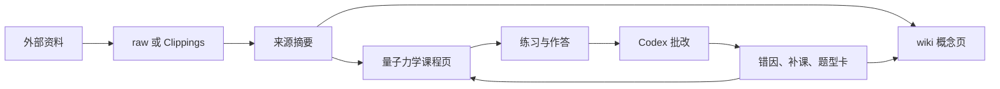

# 用 Codex 和 Obsidian 构建交互式量子力学学习助手 v2

> [!info] 这篇笔记是什么
> 这是一份可照着操作的搭建手册。目标是让同学从零完成：下载 Obsidian、创建或打开知识库、安装 Codex、在 Obsidian 里调用 Codex、配置 `AGENTS.md` 和 skill、建立交互式学习助手的 Markdown 文件、把外部资料入库，并学会手动维护与让 Codex 自动维护仓库。

## 最终效果

搭好之后，你会得到一个本地量子力学学习仓库：

- Obsidian 负责阅读、编辑、双链、知识图谱和资料管理。
- Codex 负责整理资料、生成课程、批改答案、维护索引和做健康检查。
- Markdown 文件负责长期沉淀知识，而不是把有价值回答留在聊天记录里。

学习闭环如下：



## 推荐目录结构

这个演示库当前使用如下结构：

```text
ResearchVaultshare/
├── README.md
├── 欢迎.md
├── raw/
│   ├── README.md
│   ├── articles/
│   ├── papers/
│   ├── books/
│   ├── videos/
│   ├── notes/
│   ├── datasets/
│   ├── assets/
│   └── clippings/
├── Clippings/
├── wiki/
│   ├── index.md
│   ├── log.md
│   ├── concepts/
│   ├── math/
│   ├── demos/
│   ├── sources/
│   ├── sops/
│   ├── questions/
│   ├── syntheses/
│   └── outputs/
├── 量子力学/
│   ├── 00-索引.md
│   └── 01.md
├── templates/
└── .agents/
    └── skills/
        └── quantum-learning/
            └── SKILL.md
```

目录职责：

| 目录 | 用途 | 维护方式 |
|---|---|---|
| `raw/` | 原始资料层，保存 PDF、论文、网页、视频稿、数据、图片 | 手动放入，Codex 读取后整理 |
| `Clippings/` | Obsidian Web Clipper 或手动剪藏的网页资料 | 先作为来源，不直接当正式笔记 |
| `wiki/` | 正式知识库，存概念、推导、演示、来源摘要、开放问题 | Codex 可维护 |
| `量子力学/` | 交互式课程路线、每节课、作答区、反馈区 | 学习者与 Codex 共同维护 |
| `templates/` | 新建概念页、来源页、演示页的模板 | 手动维护为主 |
| `.agents/skills/` | Codex 可调用的本仓库技能 | 手动创建，Codex 后续可优化 |

> [!warning] 原始资料不要直接改写
> 教材、论文、网页剪藏先放在 `raw/` 或 `Clippings/`。正式笔记写在 `wiki/` 和 `量子力学/`，并保留来源链接，避免以后无法校对。

## 第一步：下载并使用 Obsidian

### 下载 Obsidian

1. 打开浏览器，访问 [Obsidian 下载页](https://obsidian.md/download)。
2. 按系统下载：
   - Windows：选择 Windows 的 Universal 安装包。
   - macOS：选择 Mac 的 Universal 安装包。
   - Linux：按需要选择 AppImage、Deb、Snap 或 Flatpak。
3. 安装后打开 Obsidian。

截至 2026-05-08，Obsidian 官方下载页也提供移动端和 Web Clipper 的入口。实际按钮名称可能随版本变化，以官网页面为准。

### 创建或打开仓库

Obsidian 的仓库叫 Vault，本质是一个本地文件夹。

新建仓库：

1. 打开 Obsidian。
2. 在启动界面选择新建仓库。
3. 输入仓库名，例如 `ResearchVaultshare`。
4. 选择保存位置。
5. 点击创建。

打开已有仓库：

1. 打开 Obsidian。
2. 选择打开本地仓库。
3. 选中已有文件夹，例如：

```text
/Users/mac/Documents/mengjie/学习库/ResearchVaultshare
```

4. 点击打开。

### 使用 Obsidian 的基础动作

- 左侧文件管理器：浏览、创建、移动 Markdown 文件。
- 搜索：查找关键词、概念和来源。
- 双链：输入 `[[波函数]]` 连接到其他笔记。
- 图谱：查看笔记之间的关系。
- 阅读视图：检查 Markdown 渲染效果。
- 设置：安装插件、改编辑器配置、管理快捷键。

建议先打开这些入口：

- [[ResearchVaultshare/wiki/index|量子力学演示库入口]]
- [[ResearchVaultshare/量子力学/00-索引|量子力学学习索引]]
- [[ResearchVaultshare/wiki/log|知识库日志]]
- [[ResearchVaultshare/raw/README|原始资料说明]]

## 第二步：安装 Obsidian 终端插件

Codex 是终端工具。如果想在 Obsidian 内部调用 Codex，需要安装一个能打开终端的社区插件。

> [!warning] 社区插件安全
> Obsidian 社区插件会在本机执行第三方代码。只安装你信任的插件；安装后定期检查更新。

安装步骤：

1. 打开 Obsidian 设置。
2. 进入社区插件。
3. 选择启用社区插件。
4. 点击浏览。
5. 搜索 `Terminal`。
6. 选择你要使用的终端插件，点击安装。
7. 安装完成后点击启用。
8. 在插件设置中，把默认工作目录设置为当前仓库根目录：

```text
/Users/mac/Documents/mengjie/学习库/ResearchVaultshare
```

如果插件没有工作目录设置，就在终端里先运行：

```bash
cd "/Users/mac/Documents/mengjie/学习库/ResearchVaultshare"
```

然后再运行：

```bash
pwd
```

确认输出就是仓库根目录。

## 第三步：下载并启动 Codex

### 安装前准备

魔法上网vpn

推荐先安装 Node.js LTS，因为官方 Codex CLI 文档给出的主要安装方式是 npm。

检查是否已有 Node.js 和 npm：

```bash
node -v
npm -v
```

如果没有，先安装 Node.js LTS，再继续。

### 安装 Codex CLI

官方推荐的 npm 安装方式：

```bash
npm i -g @openai/codex
```

macOS 用户也可以使用 Homebrew：

```bash
brew install --cask codex
```

安装后检查：

```bash
codex --version
```

升级到最新版：

```bash
npm i -g @openai/codex@latest
```

### 启动 Codex

在仓库根目录运行：

```bash
codex
```

第一次启动时，Codex 会要求登录。你可以选择用 ChatGPT 账号登录，也可以按官方文档配置 API key。

> [!tip] 终端插件里找不到 `codex` 怎么办
> 这通常是 PATH 没加载。先在系统终端运行 `which codex`，例如输出 `/opt/homebrew/bin/codex`，然后在 Obsidian 终端插件里直接运行这个完整路径。也可以把终端插件的 shell 设为 `zsh`，让它读取你的 shell 配置。

## 第四步：配置 Codex

Codex 配置分三层理解：

| 层级 | 文件 | 作用 |
|---|---|---|
| 用户配置 | `~/.codex/config.toml` | 默认模型、审批策略、沙盒权限 |
| 全局说明 | `~/.codex/AGENTS.md` | 所有仓库通用的工作习惯 |
| 项目说明 | 当前仓库的 `AGENTS.md` | 这个量子力学仓库的目录规则、写作规则、维护流程 |


### 项目级 `AGENTS.md`

在仓库根目录新建 `AGENTS.md`，让 Codex 每次进入仓库时都知道规则。

可以使用下面这份：

````markdown
# AGENTS.md - 量子力学交互式学习仓库

## 角色

你是当前 Obsidian 仓库的维护者，也是量子力学学习助手。你的目标不是制造更多散乱资料，而是帮助学习者形成可复盘、可验证、可持续维护的量子力学知识库。

## 语言

- 默认用中文解释和写笔记。
- 路径、命令、文件名、变量名可以保留英文。
- 公式使用 LaTeX。

## 仓库结构

- `raw/`: 原始资料层，只保存或轻度整理来源材料。
- `Clippings/`: 外部网页剪藏，先当来源，不直接当正式笔记。
- `wiki/`: 正式知识库，包含概念、数学推导、演示、来源摘要、开放问题和输出成果。
- `量子力学/`: 交互式课程、练习、作答区和反馈区。
- `templates/`: 新笔记模板。
- `.agents/skills/`: 本仓库 Codex skills。

## 写作规则

- 正式笔记尽量添加 YAML frontmatter。
- 使用 Obsidian 双链连接内部笔记，例如 `[[wavefunction]]` 或 `[[量子力学/00-索引]]`。
- 外部网页使用普通 Markdown 链接。
- 不要把剪藏直接改成正式结论；先生成来源摘要，再判断影响哪些页面。
- 公式、定义和教材说法如果不确定，要标注待校对。

## 交互式学习流程

当用户说“继续下一课”：

1. 阅读 `量子力学/00-索引.md`。
2. 阅读当前课程和上一课的「你的作答区」「你的反馈区」。
3. 判断是否达到推进条件。
4. 如果达到，生成下一课；如果没有达到，生成补课。
5. 新课必须包含目标、核心问题、核心模型、例子、常见坑、练习、作答区、反馈区。
6. 更新 `量子力学/00-索引.md`。
7. 在 `wiki/log.md` 追加维护记录。

## 资料入库流程

当用户说“处理这份资料”：

1. 判断资料类型：论文、教材、网页、视频稿、粗略笔记、数据或图片。
2. 保留原始资料位置，不覆盖原文。
3. 在 `wiki/sources/` 或合适位置创建来源摘要。
4. 判断它影响哪些概念页、推导页、演示页或课程页。
5. 只做必要更新，不做无关重构。
6. 更新 `wiki/index.md`、相关 README 或 `wiki/log.md`。

## 健康检查流程

定期检查：

- 是否有孤立页面。
- 是否有反复出现但缺少页面的概念。
- 是否有课程页缺少练习和反馈区。
- 是否有概念页、课程页、来源摘要互相矛盾。
- 是否有 OCR 或剪藏错误进入正式笔记。
- 是否有索引没有反映真实进度。
````

Codex 官方说明中，`AGENTS.md` 会按全局和项目层级合并读取；越靠近当前目录的说明越具体。

## 第五步：配置 Codex Skill

`AGENTS.md` 适合写整个仓库的长期规则（规章制度）。Skill 更适合写一个可重复调用的专项流程（专项技能），例如“量子力学课程推进”或“资料入库”。

Codex skill 的核心形式是一个目录，里面有必需文件 `SKILL.md`。官方文档说明，skill 可以被显式调用，也可以在任务描述匹配时由 Codex 自动选择。

### 创建本仓库 skill

在仓库根目录新建：

```text
.agents/skills/quantum-learning/SKILL.md
```

内容可以这样写：

````markdown
---
name: quantum-learning
description: 用于维护 Obsidian 量子力学交互式学习仓库；当用户要求继续课程、批改答案、处理量子力学资料、生成概念页、更新索引或做仓库健康检查时使用。
---

# Quantum Learning Skill

## 输入

- 用户的自然语言请求。
- 当前 Obsidian 仓库中的 `README.md`、`wiki/index.md`、`wiki/log.md`。
- 课程文件 `量子力学/00-索引.md` 和相关课程页。
- 外部资料位于 `raw/` 或 `Clippings/`。

## 输出

- 更新后的 Markdown 笔记。
- 必要的索引更新。
- 必要的日志记录。
- 给用户的简短说明：改了什么、下一步做什么。

## 课程推进

当用户要求继续学习：

1. 读取 `量子力学/00-索引.md`。
2. 找到当前课程和下一步。
3. 检查上一课作答区和反馈区。
4. 判断推进、补课或复习。
5. 生成新课程页，文件名使用两位数字编号，例如 `02.md`。
6. 更新进度看板。
7. 追加日志。

## 批改答案

当用户要求批改：

1. 找到对应课程页。
2. 对每道题给出判断、理由和更优答案。
3. 标出知识漏洞。
4. 如果漏洞可复用，更新概念页或创建题型卡。
5. 在课程页反馈区写入批改结果。

## 资料入库

当用户要求处理资料：

1. 保留原始资料。
2. 创建来源摘要，包含资料类型、核心观点、可引用信息、可信度和待核查点。
3. 更新相关概念页或课程页。
4. 不确定的公式或结论写入待核查，不要当成定论。
5. 更新索引和日志。

## 健康检查

当用户要求维护仓库：

1. 检查孤立页、断链、空 README、缺失 frontmatter。
2. 检查课程页是否有练习、作答区、反馈区。
3. 检查概念页是否有定义、物理直觉、数学表达、常见误解。
4. 输出问题清单。
5. 能直接修的就直接修，不能直接修的列为待办。

## 写作原则

- 使用 Obsidian Markdown。
- 内部链接使用 `[[...]]`。
- 外部链接使用 `[标题](URL)`。
- 所有正式页面尽量有 frontmatter。
- 每次更新保持小步、可追踪、可回退。
````

### 如何调用 skill

显式调用：

```text
$quantum-learning 继续下一课
```

```text
$quantum-learning 请处理 Clippings/量子力学 - 维基百科，自由的百科全书 1.md，并按当前仓库规则入库
```

隐式调用：

```text
继续下一课，并更新量子力学学习索引
```

```text
请对当前量子力学仓库做一次健康检查，能修的直接修
```

如果 Codex 没有看到新 skill，重启当前 Codex 会话，再运行：

```text
/skills
```

检查列表中是否出现 `quantum-learning`。

## 第六步：在 Obsidian 终端插件中调用 Codex

推荐流程：

1. 打开 Obsidian。
2. 打开当前仓库。
3. 打开 Terminal 插件。
4. 确认当前位置：

```bash
pwd
```

5. 如果不是仓库根目录，切换目录：

```bash
cd "/Users/mac/Documents/mengjie/学习库/ResearchVaultshare"
```

6. 启动 Codex：

```bash
codex
```

7. 在 Codex 里输入任务：

```text
请阅读 README.md、wiki/index.md、量子力学/00-索引.md 和 AGENTS.md，总结当前仓库结构，并告诉我下一步应该学习哪一课。
```

常用任务：

| 你输入                       | Codex 应做什么       |
| ------------------------- | ---------------- |
| `继续下一课`                   | 读取索引和反馈，生成新课或补课  |
| `批改我的答案`                  | 批改课程页作答区，写入反馈    |
| `处理这份资料`                  | 生成来源摘要，更新相关 wiki |
| `解释这个概念并保存`               | 先查库，再写入概念页       |
| `做一轮健康检查`                 | 检查结构、链接、课程质量和日志  |
| `$quantum-learning 继续下一课` | 明确调用量子学习 skill   |
|                           |                  |
## 第七步：把已有资料、文献和外部剪藏入库
```


### 手动入库

按资料类型放置：

| 资料类型 | 放到哪里 | 例子 |
|---|---|---|
| 教材 PDF | `raw/books/` | `raw/books/griffiths-introduction.pdf` |
| 学术论文 | `raw/papers/` | `raw/papers/2026-quantum-paper.pdf` |
| 网页文章 | `raw/articles/` 或 `Clippings/` | Web Clipper 保存的网页 |
| 视频字幕或讲稿 | `raw/videos/` | `lecture-01-transcript.md` |
| 临时想法 | `raw/notes/` | `2026-05-08-学习疑问.md` |
| 图片、图表、数据 | `raw/assets/`、`raw/datasets/` | 双缝模拟图、实验数据 |

建议文件名：

```text
YYYY-MM-DD-作者-主题.md
YYYY-论文短标题.pdf
课程名-lecture-01.md
```

手动创建来源摘要时使用：

```markdown
---
title: 来源标题
tags:
  - source
  - quantum-mechanics
type: source
created: 2026-05-08
updated: 2026-05-08
source_path: raw/articles/example.md
---

# 来源标题

## 资料类型

网页 / 论文 / 教材 / 视频 / 个人笔记

## 核心内容

- 要点 1
- 要点 2
- 要点 3

## 可进入正式 wiki 的内容

- [[wavefunction]]
- [[schrodinger-equation]]

## 待核查

- 公式或说法是否需要回到原文校对。

## 后续动作

- [ ] 更新相关概念页
- [ ] 更新课程页
- [ ] 更新索引
```

### 用 Obsidian Web Clipper 剪藏

Obsidian Web Clipper 是官方浏览器扩展，可把网页内容保存到本地 vault。

安装：

1. 打开 [Obsidian Web Clipper](https://obsidian.md/help/web-clipper)。
2. 按浏览器选择 Chrome、Firefox、Safari 或 Edge 扩展。
3. 安装后登录或连接本地 Obsidian。
4. 设置保存目录为 `Clippings/` 或 `raw/clippings/`。

剪藏规则：

- 网页原文先进入 `Clippings/`。
- 不要直接把剪藏当成最终概念页。
- 让 Codex 先生成来源摘要。
- 只有长期有价值的概念才进入 `wiki/concepts/`。
- 课程相关内容再进入 `量子力学/`。

调用 Codex 入库：

```text
$quantum-learning 请处理 Clippings/文件名.md。

要求：
1. 判断资料类型和可信度。
2. 生成来源摘要。
3. 列出影响的概念页、课程页和演示页。
4. 更新必要页面。
5. 不确定内容标为待核查。
6. 更新 wiki/log.md。
```

### 文献入库

论文建议流程：

1. PDF 放入 `raw/papers/`。
2. 如果有 BibTeX 或 DOI，放在来源摘要的 frontmatter。
3. 先让 Codex 提取论文问题、方法、结论、适用边界。
4. 再让 Codex 判断是否更新概念页或演示页。
5. 不要让论文结论直接覆盖教材定义。

提示词：

```text
请处理 raw/papers/论文文件名.pdf。

输出：
1. 一页来源摘要，写入 wiki/sources/。
2. 论文解决的问题、核心方法、关键结论、限制。
3. 它和当前量子力学课程的关系。
4. 需要更新的 wiki 页面。
5. 待核查的公式、实验条件或术语。
```

## 第八步：自己手动操作仓库

手动维护时，按“小步、可追踪、先来源后结论”的原则做。

### 每次学习

1. 打开 `量子力学/00-索引.md`。
2. 找到当前课程。
3. 阅读课程页。
4. 在「你的作答区」写答案。
5. 在 Obsidian 终端插件里启动 Codex。
6. 输入：

```text
请批改 量子力学/01.md 的作答区，并把反馈写入反馈区。
```

7. 阅读反馈。
8. 如果有长期价值，让 Codex 更新相关概念页或题型卡。

### 每次添加资料

1. 把原始资料放进 `raw/` 或 `Clippings/`。
2. 新建来源摘要，或让 Codex 创建。
3. 手动检查摘要是否忠于原文。
4. 决定是否更新正式 wiki。
5. 更新 `wiki/log.md`。

### 每周维护

1. 打开 `wiki/index.md`，检查入口是否可用。
2. 打开 `量子力学/00-索引.md`，检查进度是否真实。
3. 搜索 `待核查`、`TODO`、`待生成`。
4. 检查新资料是否还堆在 `Clippings/`。
5. 把已整理资料链接到 `wiki/sources/README.md` 或相关 README。
6. 在 `wiki/log.md` 写一条维护记录。

维护日志模板：

```markdown
## 2026-05-08

- 整理内容：
- 新增页面：
- 更新页面：
- 待核查：
- 下一步：
```

## 第九步：让 Codex 自动整理和维护仓库

### 自动整理资料

```text
$quantum-learning 请整理最近新增的 raw/ 和 Clippings/ 资料。

要求：
1. 列出新增资料。
2. 按资料类型分类。
3. 为每份资料生成或更新来源摘要。
4. 判断它影响哪些概念页、数学页、演示页或课程页。
5. 只做必要更新。
6. 更新索引和 wiki/log.md。
```

### 自动推进课程

```text
$quantum-learning 继续下一课。

要求：
1. 读取 量子力学/00-索引.md。
2. 检查当前课程作答区和反馈区。
3. 判断推进或补课。
4. 如果推进，生成下一课。
5. 如果补课，生成补课页并说明原因。
6. 更新进度看板和偏航记录。
```

### 自动批改答案

```text
$quantum-learning 请批改当前课程的作答区。

要求：
1. 逐题判断正确、部分正确或错误。
2. 给出更优答案。
3. 标出误区。
4. 判断是否达到推进条件。
5. 把反馈写回课程页。
6. 必要时更新概念页或题型卡。
```

### 自动健康检查

```text
$quantum-learning 请对当前量子力学知识库做一轮健康检查。

检查：
1. 孤立页面。
2. 断链或错误链接。
3. 缺少 frontmatter 的正式笔记。
4. 课程页是否缺少练习、作答区、反馈区。
5. 概念页是否缺少定义、数学表达、物理直觉、常见误解。
6. Clippings 是否有长期未整理资料。
7. wiki/log.md 是否记录了最近维护。

输出：
1. 问题列表。
2. 严重程度。
3. 已修复内容。
4. 剩余待办。
```

### 自动生成阶段复盘

```text
$quantum-learning 请根据 量子力学/00-索引.md 和已完成课程生成一次阶段复盘。

要求：
1. 总结已掌握概念。
2. 列出薄弱点。
3. 给出下一阶段路线。
4. 生成 3 道综合练习。
5. 写入 wiki/syntheses/。
```

## 第十步：Markdown 格式速查

Markdown 是一种轻量标记语言。你写的是纯文本，但可以通过简单符号表达标题、列表、链接、公式和代码块。Obsidian 在 Markdown 基础上增加了双链、嵌入、callout 等功能。

### 标题

```markdown
# 一级标题
## 二级标题
### 三级标题
```

### 加粗、斜体、高亮

```markdown
**加粗**
*斜体*
==高亮==
```

### 列表

```markdown
- 无序列表
- 第二项

1. 有序列表
2. 第二项

- [ ] 待完成任务
- [x] 已完成任务
```

### 链接

内部笔记使用 Obsidian 双链：

```markdown
[[wavefunction]]
[[量子力学/00-索引]]
[[量子力学/01|为什么经典物理不够用]]
```

外部网页使用 Markdown 链接：

```markdown
[Obsidian](https://obsidian.md)
```

### 图片和嵌入

```markdown
![[image.png]]
![[paper.pdf#page=3]]
```

### 代码和命令

行内代码：

```markdown
运行 `codex` 启动 Codex。
```

代码块：

````markdown
```bash
codex
```
````

### 数学公式

行内公式：

```markdown
能量量子为 $E = h\nu$。
```

块级公式：

```markdown
$$
i\hbar \frac{\partial}{\partial t}\psi = \hat H \psi
$$
```

### Callout 提示框

```markdown
> [!note]
> 这是普通提示。

> [!warning]
> 这是警告。

> [!tip]
> 这是建议。
```

### Frontmatter

正式笔记顶部建议加元数据：

```yaml
---
title: 波函数
tags:
  - quantum-mechanics
  - concept
type: concept
created: 2026-05-08
updated: 2026-05-08
---
```

## 验收标准

搭建完成后，用下面清单检查：

- [ ] Obsidian 能打开当前仓库。
- [ ] Terminal 插件能打开终端。
- [ ] 在仓库根目录能运行 `codex`。
- [ ] 仓库根目录有 `AGENTS.md`。
- [ ] `.agents/skills/quantum-learning/SKILL.md` 已创建。
- [ ] Codex 能通过 `$quantum-learning` 调用 skill。
- [ ] `量子力学/00-索引.md` 能指向当前课程。
- [ ] 每节课都有练习、作答区、反馈区。
- [ ] 新资料先进入 `raw/` 或 `Clippings/`，再进入正式 wiki。
- [ ] `wiki/log.md` 记录了重要维护动作。

## 一句话总结

Obsidian 是量子力学知识库的工作台，Codex 是持续维护和教学的代理，Markdown 是长期沉淀知识的文件格式。真正有价值的不是一次问答，而是每次学习、剪藏、批改和复盘都能写回仓库，让这个系统越来越会教你。
