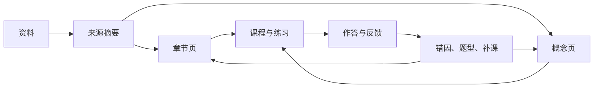
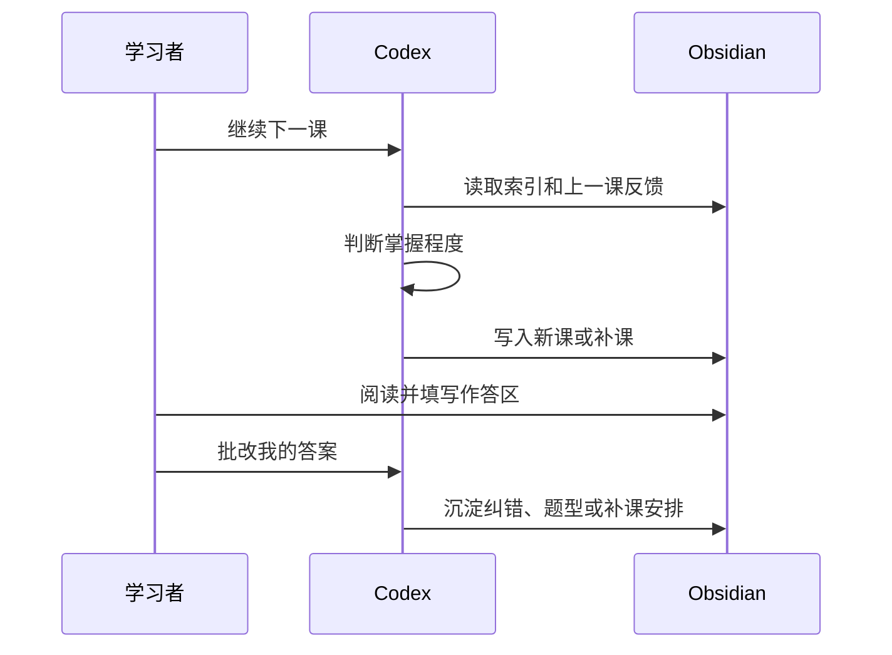

# 用 Codex 和 Obsidian 构建交互式量子力学学习助手

> [!info] 这篇笔记是什么
> 这是一份用于和同学分享的教程笔记，目标是演示如何用 Codex 和 Obsidian 搭建一个交互式量子力学学习助手。它基于 `Karpathy-AI+Obsidian知识库教程-栗氪聊AI.docx` 的思路改写：原教程讲的是用 AI 与 Obsidian 搭建可持续维护的 LLM Wiki（大语言模型维基）；这里把同一套方法迁移到量子力学学习场景。

## 教程目标

看完并照着操作后，同学应该能完成三件事：

- 建立一个适合长期学习的 Obsidian 量子力学知识库。
- 让 Codex 按固定规则整理教材、概念、练习和反馈。
- 把一次性问答变成可沉淀、可复盘、可继续推进的学习系统。

适合对象：

- 正在学习量子力学，希望用 AI 辅助整理知识的同学。
- 已经会基础 Markdown，但还没有建立系统笔记流程的同学。
- 想把教材、网页资料、错题和代码模型统一管理的同学。

> [!note] 分享时的讲解顺序
> 建议按“为什么要这样做 → 需要哪些工具 → 如何搭文件夹 → 如何写规则 → 如何让 Codex 生成课程 → 如何定期检查”的顺序讲。这样同学先理解方法，再照着步骤复现。

## 核心思路

Obsidian 是量子力学知识库的 IDE（Integrated Development Environment，集成开发环境），Codex 是维护与教学代理，Markdown wiki 是可持续积累的学习代码库。

这套系统的目标不是堆积更多资料，而是形成一个学习闭环：



每一次学习、提问、批改和建模，都应该让知识库更会教你下一步。

## 英文术语注释

| 英文 | 中文注释 | 在本文中的含义 |
|---|---|---|
| AI | Artificial Intelligence，人工智能 | 泛指辅助整理、教学和推理的模型系统 |
| LLM | Large Language Model，大语言模型 | Codex 背后的语言模型能力 |
| LLM Wiki | 大语言模型维基 | 由 AI 持续维护、可复用、互相链接的知识库 |
| Vault | Obsidian 知识库 | Obsidian 管理的一整个笔记文件夹 |
| Markdown | 轻量标记语言 | 笔记正文格式 |
| Frontmatter | 文件头元数据 | Markdown 顶部 `---` 包裹的属性区 |
| Schema | 结构约定 | 规定目录、页面类型、写作规则和工作流 |
| CLI | Command Line Interface，命令行界面 | 在终端中使用的 Codex 工具 |
| IDE | Integrated Development Environment，集成开发环境 | 这里比喻 Obsidian 是学习知识库的工作台 |
| RAG | Retrieval-Augmented Generation，检索增强生成 | 每次回答前临时检索资料再生成答案的方法 |
| Ingest | 资料入库 | 将外部资料整理为摘要、概念页或章节页 |
| Query | 查询/问答 | 用户提问时，先查知识库再回答 |
| Lint | 健康检查 | 检查链接、结构、公式、进度和学习质量 |
| Graph | 知识图谱 | Obsidian 中展示笔记关系的图 |
| Plugin | 插件 | Obsidian 或 Codex 的功能扩展 |

## 第一步：准备工具

### Obsidian

Obsidian 是这个学习助手的主界面，负责：

- 保存 Markdown 笔记。
- 展示双链和知识图谱。
- 维护章节页、概念页、学习路线和反馈记录。
- 让学习材料长期可检索、可链接、可复盘。

#### 在 Windows 上安装 Obsidian 

1. 打开浏览器，访问 [Obsidian 下载页面](https://obsidian.md/zh/download)。
2. 在**Windows**下，点击**Universal**下载安装包。
3. 打开安装文件，按照指示操作。
4. 安装完成后，按打开其他应用一样的方法打开 Obsidian。

#### 在 macOS 上安装 Obsidian 

1. 打开浏览器，访问[Obsidian 下载页面](https://obsidian.md/zh/download)。
2. 在**macOS**下，点击**Universal**下载安装文件。
3. 打开安装文件。
4. 在打开的窗口中，将 Obsidian 拖动到"应用程序"文件夹中。
5. 安装完成后，按打开其他应用一样的方法打开 Obsidian。

### Codex

Codex 是这个系统里的维护者和学习教练。它负责阅读当前文件夹中的资料，生成笔记，更新索引，批改练习，维护概念页和学习流程。

在这个知识库中，Codex 不应被当作“临时聊天窗口”，而应像维护代码库一样维护一套量子力学学习 wiki：

- 读取 `README.md` 和仓库规则，理解目录约定。
- 读取 `obsidian/wiki/`，定位学习路线和维护状态。
- 读取 `obsidian/chapters/` 与 `obsidian/concepts/`，组织章节和概念。
- 必要时回到 `ocr/` 或 `书籍/` 校对来源。
- 写入课程、概念、题型、模型说明和阶段复盘。

> [!tip] Codex 与 Claude Code 的对应关系
> 原教程使用 Claude Code 与 Claudian。这里对应替换为 Codex。关键差异不在模型名称，而在是否有清晰的仓库结构、schema（结构约定）和可复用工作流。

常见安装方式：

```bash
npm install -g @openai/codex
```

```bash
brew install --cask codex
```

启动方式：

```bash
codex
```

> [!note] 英文原句注释
> “Codex CLI is a coding agent from OpenAI that runs locally on your computer.”
>
> 注释：Codex CLI（命令行版 Codex）是 OpenAI 提供的本地编码代理，可以在你的电脑上读取项目文件、运行命令并协助修改代码或笔记。

如果想在代码编辑器中使用 Codex，可安装 IDE（集成开发环境）插件；如果想使用桌面应用体验，可运行 `codex app` 或访问 Codex App 页面。云端版本通常称为 Codex Web（网页版 Codex）。


## 第二步：创建仓库

Obsidian 将所有笔记保存在仓库中。仓库本质上是本地文件系统中的一个文件夹。你可以将所有笔记保存在一个仓库里，也可以为不同的项目创建不同仓库。

第一次打开 Obsidian 时，Obsidian 会询问你是否要创建一个新仓库。此时你有两个选择，你可以创建一个新仓库，或者将现有文件夹作为仓库打开。

### 创建仓库 

要创建一个新的空仓库：

1. 在**新建仓库**右侧，点击**创建**。
2. 在**仓库名称**中，输入你的仓库名称。
3. 点击**浏览**选择新仓库的保存位置。
4. 点击**创建**。

### 将已有文件夹作为仓库打开 

如果你想把一个现有文件夹作为仓库打开：

1. 在**打开本地仓库**右侧，点击**打开**。
2. 在文件浏览器中，选择你想要用作仓库的文件夹。
3. 点击**打开**。

如果你想了解更多关于仓库如何工作的信息，请查看[Obsidian 的储存机制](https://obsidian.md/zh/help/data-storage)。

现在，你已经设置好仓库了，可以开始[创建第一篇笔记](https://obsidian.md/zh/help/create-note)了。
## 第三步：安装推荐技能与插件

#### 第三方插件

了解如何使用社区构建的插件来扩展 Obsidian。使用插件可以让 Obsidian 适应你的特定需求，例如支持额外的文件格式或与第三方服务集成。

警告

社区插件会代替你运行第三方代码，这些代码可能带来潜在风险。要了解 Obsidian 团队如何防范有害插件的更多信息，请参阅[插件安全](https://obsidian.md/zh/help/plugin-security)。

#### 浏览社区插件 

1. 打开 **[设置](https://obsidian.md/zh/help/settings)**。
2. 选择**关闭安全模式**。更多信息请参阅[受限模式](https://obsidian.md/zh/help/plugin-security#%E5%8F%97%E9%99%90%E6%A8%A1%E5%BC%8F)。
3. 选择**浏览**以列出所有可用的社区插件。

使用文本框可以根据名称、作者和描述来筛选插件。

你也可以在浏览器中浏览可用插件，前往 [obsidian.md/plugins](https://obsidian.md/zh/plugins)。

#### 安装社区插件 

要安装社区插件，你必须先关闭[受限模式](https://obsidian.md/zh/help/plugin-security#%E5%8F%97%E9%99%90%E6%A8%A1%E5%BC%8F)。

1. 打开 **[设置](https://obsidian.md/zh/help/settings)**。
2. 在侧边菜单中，选择**社区插件**。
3. 选择**浏览**以探索可用的社区插件。
4. 选择你想安装的插件。
5. 选择**安装**。

要使用已安装的插件，你需要启用它。

#### 启用社区插件 

你可以在安装后直接选择**启用**，也可以在**[设置](https://obsidian.md/zh/help/settings) → 社区插件 → 已安装插件**下的社区插件列表中启用它。

#### 更新插件 

出于安全考虑，社区插件不会自动更新。你可以一次性更新所有插件，也可以单独更新某个插件。

要更新所有插件：

1. 打开 **[设置](https://obsidian.md/zh/help/settings)**。
2. 在**社区插件 → 插件安装情况**下，选择**检查更新**。
3. 如果有可用更新，选择**全部更新**。

要更新单个插件：

1. 打开 **[设置](https://obsidian.md/zh/help/settings)**。
2. 在**社区插件 → 插件安装情况**下，选择**检查更新**。
3. 在**已安装插件**下，选择你想更新的插件旁边的**更新**。

当前工作中最常用的是两类能力：

| 技能 | 作用 |
|---|---|
| Obsidian Markdown | 生成 frontmatter、双链、callout、Mermaid、任务清单 |
| Documents | 读取 Word 文档并抽取原教程结构 |
插件terminal


##  在第三方插件中搜索terminal，安装-启用和第一步中启用codex一样，在命令行中输入codex即可

后续可以按需要扩展：

- PDF 处理：把教材 PDF 或讲义拆成可整理底稿。
- Spreadsheets：维护题目、错因、掌握度表格。
- Presentations：把阶段学习结果输出成 slides（幻灯片）。
- Browser：检查 Obsidian 或本地页面的可视化效果。

> [!note] Skill 写作原则
> 以下原则适合用于创建 Obsidian 或 Codex 的 skill（技能）：
>
> - “Keep each skill focused on one job.”
>   每项技能只专注一项任务。
> - “Prefer instructions over scripts unless you need deterministic behavior or external tooling.”
>   除非需要确定性行为或外部工具，否则优先写清楚操作指令，而不是直接写脚本。
> - “Write imperative steps with explicit inputs and outputs.”
>   使用命令式步骤，并明确输入与输出。
> - “Test prompts against the skill description to confirm the right trigger behavior.”
>   用真实提示测试技能描述，确认它会在正确场景触发。

## 第四步：搭建知识库结构

原教程的第一步是让 AI 根据 Karpathy 的 wiki 方法论自动建立文件夹。先展示一套已经搭好的示例结构，再说明同学如何迁移到自己的课程或教材。

建议保持如下结构：

```text
量子力学知识库/
├── README.md
├── 欢迎.md
├── 量子力学.md
├── 交互式学习仓库.md
├── obsidian/
│   ├── chapters/
│   ├── concepts/
│   └── wiki/
├── ocr/
├── code/
│   └── models/
├── results/
│   └── plots/
├── skills/
├── ../Clippings/
├── 书籍/
└── 量子力学/
    └── 00-索引.md
```

目录职责：

| 目录 | 作用 | Codex 权限 |
|---|---|---|
| `书籍/` | 原始 PDF 或教材资料 | 只读 |
| `ocr/` | OCR 底稿 | 只读为主 |
| `../Clippings/` | 外部剪藏资料 | 可读取、可整理 |
| `obsidian/chapters/` | 章节级知识地图 | 可维护 |
| `obsidian/concepts/` | 原子概念页 | 可维护 |
| `obsidian/wiki/` | 总览、进度、维护规则 | 可维护 |
| `skills/` | 题型、流程、学习方法 | 可维护 |
| `code/models/` | 可计算模型代码 | 可维护 |
| `results/plots/` | 模型输出图像 | 可生成 |
| `量子力学/` | 交互式课程路线 | 可维护 |

可以直接把下面这段话发给 Codex，让它检查结构：

```text
请阅读当前知识库的 README、交互式学习仓库.md、obsidian/wiki/仓库结构与维护.md。
然后检查这个量子力学学习助手的目录是否完整。
如果缺少交互式课程入口、索引、日志或题型目录，请给出最小改动方案并直接补齐。
```


> [!warning] 不要频繁新建 Vault
> 推荐使用“一个主 Vault + 多个子项目”的结构。频繁新建 vault 会导致插件配置重复、Dataview 查询和双链关系断裂、Graph（知识图谱）碎片化。


## 第五步：理解 LLM Wiki 方法论

原教程的核心是 Karpathy 的 LLM Wiki 方法论：不要只让模型临时检索资料，而是让模型持续维护一个结构化、互相链接、会积累的 wiki。

改写到量子力学学习中，核心思想是：

> [!quote] 量子力学 LLM Wiki 方法论
> 不把 Codex 当成一次性问答工具，而是让它持续维护一个量子力学 wiki。每次学习、提问、练习、纠错、建模都沉淀回 Obsidian。知识不是每次重新检索，而是在章节页、概念页、题型卡、模型图和学习记录中持续复利。

### 三层架构

| 层级 | 当前目录 | 说明 |
|---|---|---|
| 原始资料层 | `书籍/`、`ocr/`、`../Clippings/` | 教材、OCR、外部文章、视频摘录；作为来源，不随意改写 |
| Wiki 层 | `obsidian/chapters/`、`obsidian/concepts/`、`obsidian/wiki/` | Codex 维护的正式知识库 |
| 学习交互层 | `量子力学/`、`skills/`、`code/models/`、`results/plots/` | 课程、练习、题型、模型、图像和反馈 |

### 为什么不用普通 RAG

普通 RAG（检索增强生成）的思路是每次提问都重新找资料、重新拼接、重新解释。对于量子力学这种概念高度耦合的学科，这会带来三个问题：

- 同一个概念每次解释角度可能不一致。
- 公式、边界条件和适用场景容易散落。
- 做题错误不能自然沉淀为下一次学习的依据。

LLM Wiki 的做法是把中间成果保存下来：

- [[ResearchVault/obsidian/concepts/波函数]] 不只是一次解释，而是长期维护的概念页。
- [[Schrodinger 方程]] 不只是公式，而是和定态、算符、边界条件、概率流相连的节点。
- 一道错题不只是一次批改，而是会进入题型卡或补课路线。

## 第六步：写入 Codex 行为配置

原教程用 `CLAUDE.md` 定义 Claude 的行为。迁移到 Codex 时，可以用 `AGENTS.md`、`README.md` 或一页专门的仓库说明来定义 Codex 的 schema（结构约定）。若已经有 `交互式学习仓库.md` 这类说明页，可以直接把它作为规则来源。

可以把下面这份配置保存为 `AGENTS.md`，或者复制给 Codex 作为长期规则草案：

````markdown

# Codex Schema — 交互式量子力学学习助手

## 角色

你是我的量子力学学习助手，也是当前 Obsidian 知识库的维护者。

你的目标不是生成更多资料，而是帮助我逐步达到可验证的量子力学掌握：

- 能解释概念解决什么问题。
- 能写出公式并说明适用条件。
- 能完成典型推导。
- 能识别题型并选择解题路径。
- 能发现并纠正自己的错误。

## 语言

- 永远用中文教学和写文档。
- 命令、路径、代码、变量名可以保留英文。

## 仓库结构

```text
obsidian/chapters/   教材章节页
obsidian/concepts/   原子概念页
obsidian/wiki/       知识地图、整理进度、维护规则
ocr/                 OCR 底稿，只读为主
书籍/                原始 PDF，只读
../Clippings/        外部剪藏资料
skills/              题型、学习流程、方法卡
code/models/         可计算模型脚本
results/plots/       模型输出图像
量子力学/            交互式课程路线
```

## 页面约定

所有正式笔记尽量包含 YAML frontmatter（文件头元数据）：

```yaml
---
title: 页面标题
tags:
  - quantum-mechanics
created: YYYY-MM-DD
updated: YYYY-MM-DD
type: concept | chapter | course | skill | source | index
---
```

内部链接使用 Obsidian 双链：

```markdown
[[波函数]]
[[Schrodinger 方程]]
[[谐振子]]
```

## 学习工作流

当用户说“继续下一课”时：

1. 阅读 `量子力学/00-索引.md`。
2. 阅读上一课的「你的作答区」和「你的反馈区」。
3. 判断是否达到 80%-90% 掌握。
4. 如果达到，推进下一课；如果没有达到，生成补课。
5. 新课必须包含讲解、例子、常见坑、练习。
6. 不要提前给出练习答案。
7. 更新 `量子力学/00-索引.md` 的进度和偏航记录。

## Ingest 工作流

当用户说“处理这份资料”或“摄取这篇文章”时：

1. 读取原始资料。
2. 生成来源摘要。
3. 判断它影响哪些章节、概念或题型。
4. 更新已有页面。
5. 只有当概念具有长期价值时，才新建独立概念页。
6. 更新索引。
7. 追加日志。

## Query 工作流

当用户提问时：

1. 先查找相关章节页和概念页。
2. 必要时回到 OCR 底稿。
3. 回答要说明来源、边界条件和常见误解。
4. 如果回答有长期价值，询问或直接沉淀为新笔记。

## Lint 工作流

定期检查：

- [ ] 是否有孤立概念页。
- [ ] 是否有提到但缺页的概念。
- [ ] 是否有章节页和概念页说法不一致。
- [ ] 是否有 OCR 公式错误进入正式笔记。
- [ ] 是否有题型只写答案、没有沉淀方法。
- [ ] 是否有学习路线偏航但没有记录。

## 课程模板

```markdown
# 标题

## 目标（预计 5-10 分钟）

## 核心问题

## 第一性原理/核心模型

## 关键概念与例子

## 常见坑

## 练习（1-3 题）

## 你的作答区（用户填写）

## 你的反馈区（用户填写）
```
````

> [!warning] 注意
> 上面这段 schema 可以单独保存为 `AGENTS.md`，也可以并入 [[交互式学习仓库]]。如果已有规则冲突，优先保持当前仓库的既有目录约定。

## 第七步：把资料放进知识库

原教程推荐用 Obsidian Web Clipper 把网页一键保存到指定位置。对量子力学学习助手来说，内容来源主要有四类：

| 来源 | 放置位置 | 处理方式 |
|---|---|---|
| 教材 PDF | `书籍/` | 作为最终校对来源 |
| OCR 文本 | `ocr/` | 作为章节整理底稿 |
| 网页剪藏 | `../Clippings/` | 先做来源摘要，再决定是否入 wiki |
| 自己的学习反馈 | `量子力学/` | 直接影响下一课推进或补课 |

演示资料入库时，可以使用这段提示词：

```text
请处理这份新资料，并按当前量子力学知识库规则入库。

要求：
1. 先判断资料类型：教材、OCR、网页剪藏、论文、视频讲稿、个人反馈。
2. 生成一页来源摘要。
3. 列出它影响的章节页、概念页和题型卡。
4. 只更新必要页面，不做无关重构。
5. 如果发现新概念，判断是否值得创建独立概念页。
6. 更新索引或进度记录。
```
### Obsidian Web Clipper

如果后续要把网页、论文、视频讲稿或课程资料加入量子力学知识库，推荐安装 Obsidian Web Clipper（网页剪藏器）。

用途：

- 将网页保存为 Markdown。
- 将外部资料统一放入 `../Clippings/` 或专门的来源目录。
- 让 Codex 后续把剪藏内容整理进正式 wiki。

建议规则：

- 外部剪藏先放 `../Clippings/`。
- 不要直接把剪藏当作最终笔记。
- 先生成来源摘要，再决定是否更新概念页、章节页或题型卡。
## 第八步：建设概念页

原教程强调：新增内容后，直接告诉 AI，它会根据 schema 自动建立 wiki。量子力学尤其适合这样做，因为概念之间强依赖、强互链。

概念页不是简单定义，而要包含：

- 它解决什么问题。
- 数学定义。
- 物理直觉。
- 适用条件。
- 典型题型。
- 常见误解。
- 相关双链。

概念页模板：

```markdown
---
title: 概念名
tags:
  - quantum-mechanics
  - concept
type: concept
created: YYYY-MM-DD
updated: YYYY-MM-DD
---

# 概念名

## 它解决什么问题

## 数学定义

## 物理直觉

## 适用条件

## 典型题型

## 常见误解

## 相关概念

- [[相关概念 A]]
- [[相关概念 B]]
```

示例：处理 [[谐振子]] 时，不要只写能级公式，还要链接到：

- [[本征值问题]]
- [[力学量算符]]
- [[矩阵形式]]
- [[对易关系与不确定性关系]]
- [[定态与非定态]]

## 第九步：定期健康检查

Lint（健康检查）是原教程中的关键步骤。内容多了之后，要让 AI 检查 wiki 是否健康。对量子力学学习助手来说，Lint 不只是检查链接，还要检查学习质量。

可以直接对 Codex 说：

```text
请对当前量子力学知识库做一轮健康检查。

检查范围：
1. 孤立页面：有没有没有入链或出链的概念页。
2. 缺失概念：有没有章节中反复出现但没有独立页面的概念。
3. 公式风险：有没有 OCR 可能导致错误的公式。
4. 结构风险：章节页、概念页、题型卡是否职责混乱。
5. 学习风险：课程是否只讲知识，没有练习和反馈区。
6. 进度风险：索引是否反映了真实进度。

输出：
- 问题列表。
- 严重程度。
- 建议修复顺序。
- 可以直接修复的内容请直接修复。
```

Lint 结果建议追加到维护页或日志中：

```markdown
## [2026-05-07] lint | 量子力学知识库健康检查

- 检查范围：
- 发现问题：
- 已修复：
- 后续待办：
```

## 第十步：保存高价值回答

原教程的一个重要实践是：当你觉得 AI 的回答有价值，不要让它留在聊天记录里，而是写回 wiki。

在量子力学学习中，以下内容特别值得沉淀：

- 一个解释很清楚的概念类回答。
- 一道题的通用解法。
- 一个常见误区的纠正。
- 一次阶段复盘。
- 一个可计算模型。
- 一组概念之间的对比。

提示词：

```text
刚才这个回答有长期价值。请把它保存到当前 Obsidian 知识库。

要求：
1. 判断应该保存为概念页、题型卡、课程补充、对比页还是复盘页。
2. 使用 Obsidian Markdown。
3. 加 frontmatter。
4. 加上必要双链。
5. 更新相关索引。
6. 不要重复创建已有页面，优先更新已有页面。
```

适合保存的页面类型：

| 类型 | 目录 | 例子 |
|---|---|---|
| 概念页 | `obsidian/concepts/` | `Born 概率诠释.md` |
| 题型卡 | `skills/` | `一维势阱题型流程.md` |
| 课程页 | `量子力学/` | `01-波函数到底描述什么.md` |
| 模型说明 | `code/models/` + `results/plots/` | 无限深势阱、谐振子 |
| 对比页 | `obsidian/wiki/` | Schrodinger 图像与 Heisenberg 图像对比 |

## 第十一步：运行交互式学习流程

这一部分是教程演示中最重要的部分：让 wiki 不只是资料库，而是学习闭环。

### 第一条推荐路线


对应页面：

- [[ResearchVault/obsidian/concepts/波函数]]
- [[Born 概率诠释]]
- [[Schrodinger 方程]]
- [[定态与非定态]]
- [[力学量算符]]
- [[本征值问题]]
- [[对易关系与不确定性关系]]
- [[方势阱]]

### 每节课固定结构

```markdown
# 标题

## 目标（预计 5-10 分钟）

## 核心问题

## 第一性原理/核心模型

## 关键概念与例子

## 常见坑

## 练习（1-3 题）

## 你的作答区（用户填写）

## 你的反馈区（用户填写）
```

从第二节课开始，开头必须加：

```markdown
## 上一课反馈处理

- 纠错要点：
- 标准解/更优解：
- 是否推进：
- 一句话理由：
```

### 学习闭环



### 常用触发语

| 触发语 | Codex 应执行的动作 |
|---|---|
| `继续下一课` | 读取反馈，判断推进或补课，生成新课 |
| `批改我的答案` | 对练习逐题批改，给标准解，判断掌握 |
| `解释这个概念` | 查找相关概念页，给出模型、直觉和误区 |
| `这题属于什么类型` | 归类题型，沉淀通用解法 |
| `给我一个可计算模型` | 写模型脚本，输出图像，嵌回笔记 |
| `做一轮健康检查` | 执行 Lint，修复结构和链接问题 |
| `把这个回答保存到 wiki` | 选择合适页面类型并写回知识库 |

## 量子力学学习材料

示例知识库已有的核心材料：

| 材料 | 位置 | 用途 |
|---|---|---|
| 曾谨言《量子力学教程》章节整理 | `obsidian/chapters/` | 主线学习 |
| 概念页 | `obsidian/concepts/` | 概念澄清与双链 |
| OCR 底稿 | `ocr/` | 回查教材原文 |
| 教材知识地图 | [[量子力学教程（曾谨言）知识地图]] | 导航 |
| 整理进度 | [[量子力学教程（曾谨言）整理进度]] | 维护状态 |
| 学习流程 | [[量子力学教材系统化学习流程]] | 处理教材的方法 |

后续可补充的外部资料：

- MIT OpenCourseWare 量子力学课程。
- Griffiths《Introduction to Quantum Mechanics》。
- Sakurai《Modern Quantum Mechanics》。
- Cohen-Tannoudji《Quantum Mechanics》。
- 量子力学可视化模拟资料。
- 适合练习的题库或课程作业。

> [!warning]
> 外部资料进入知识库时不要直接覆盖现有笔记。先作为来源摘要保存，再由 Codex 判断它应该更新哪个概念页、章节页或题型卡。

## 验收标准

这个系统是否搭建成功，不看笔记数量，而看以下标准：

- [ ] 能从索引找到下一课。
- [ ] 每节课都有练习和反馈区。
- [ ] Codex 能根据上一课反馈决定推进或补课。
- [ ] 概念页之间有稳定双链。
- [ ] 章节页、概念页、题型卡职责清楚。
- [ ] 重要公式能回查到 OCR 或教材来源。
- [ ] 错题能沉淀为题型或补课。
- [ ] 好回答能写回 wiki，而不是留在聊天记录里。
- [ ] 定期 Lint 能发现孤立页、缺失概念和公式风险。

## 一句话总结

Obsidian 是量子力学知识库的 IDE，Codex 是维护和教学的代理，Markdown wiki 是持续积累的代码库。每一次学习、提问、批改和建模，都应该让这个系统变得更会教你下一步。
